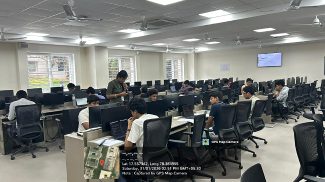
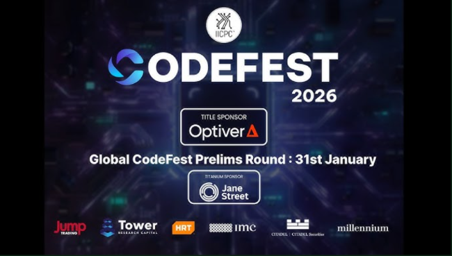
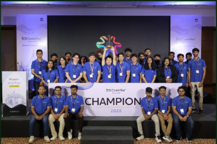

Greetings Readers,

The excitement continued into 2026 with the successful conduct of the **IICPC (InterCollegiate Informatic and Competitive Programming Camp)** on January 31st, 2026 at **VNR Vignana Jyothi Institute of Engineering and Technology**.The event brought together talented coders from various institutions, creating a vibrant atmosphere of competition, learning and collaboration.

---

<h1>Highlights</h1>

  

 

  

 

Team <strong>Turing Hut</strong> successfully conducted the
<strong>InterCollegiate Informatic and Competitive Programming Camp (IICPC) Prelims</strong>
at VNRVJIET, with college labs allocated for all
<strong>187 shortlisted participants</strong>, marking a proud milestone for the institute.VNRVJIET was the only <strong>non-IIT/IIIT college in Telangana</strong>, and the only <strong>private college</strong>, to be granted this prestigious opportunity, reflecting its growing
reputation in the competitive programming ecosystem.This achievement stands as a testament to the efforts of <strong>Turing Hut</strong> in fostering and
spreading a strong competitive programming culture across the institution, while providing students
with a high-quality platform to compete, learn, and grow in problem-solving and algorithmic thinking.

---

  

<h1>Game of Code Play</h1>

1. A scrambled word will be provided along with a hint from the world of coding
 
2. Read the hint carefully
 
3. Unscramble the letters to form the correct word

<h2 style="margin-top:25px;">
Your &lt;Time/&gt;; Starts Now
</h2>

a. <b>TPOIRNE</b> → Stores address of another variable
 
b. <b>PHEA</b> → A tree-based data structure used for priority queues
 
c. <b>RURCESION</b> → Function calling itself to solve subproblems
 
d. <b>GNIRTS</b> → Sequence of characters
 
e. <b>MOCXELIPTYTI</b> → Measures efficiency of an algorithm

---
# Interesting Reads

<table style="width:100%;">
<tr>

<td style="width:50%; vertical-align:top; padding-right:25px;">

 

Tata Consultancy Services announced the winners of the <b>2026 edition of its global coding competition, TCS CodeVita™</b>. Zhou Jingkai secured the top honour. Vicente Opazo and Jorge Valdivia emerged as runners-up. This year’s edition marked a benchmark with <b>146,922 participants</b>, earning TCS a new Guinness World Record...<a href="https://cxotoday.com/media-coverage/tcs-codevita-2026-hits-guinness-world-record-as-china-wins-top-prize/" target="_blank">read more</a>

</td>

<td style="width:50%; vertical-align:top; padding-left:25px;">

 

Three competitive programming teams from Northwestern participated in the <b>2025 International Collegiate Programming Contest’s (ICPC) North America Mid-Central Regional Contest</b>, held at the University of Illinois Urbana-Champaign. Together, the teams finished among the top global performers...<a href="https://www.mccormick.northwestern.edu/computer-science/news-events/news/articles/2026/competitive-programming-team-advances-to-2026-icpc-north-america-championship.html" target="_blank">read more</a>

</td>

</tr>
</table>
 

That wraps up our list of interesting reads. Now, it’s time to put your skills to work in the given problem section!

 

---

<h1 style="font-style:italic;">
ToDo Problem
</h1>

Here’s a great problem we think you’ll enjoy solving:
<a href="https://codeforces.com/problemset/problem/1702/D">problem link</a>.

Have any experiences, opportunities or articles to share?
Fill out this <a href="https://docs.google.com/forms/d/e/1FAIpQLSfdaR5IK8B9RZx-5G3cd4_G4RMsLIaHRMWpGWzTwMyuMdCeWg/viewform">form</a> to be featured in our next newsletter.

Thanks to Shreyas(23071A05U2), Vinati(23071A05D4), Anika(23071A04K4)
and Amogh(23071A3208) for contributing to the newsletter.

 

a. POINTER &nbsp;&nbsp;
b. HEAP &nbsp;&nbsp;
c. RECURSION &nbsp;&nbsp;
d. STRING &nbsp;&nbsp;
e. COMPLEXITY

